# ISOCUBE — build a transformer from scratch, and ship it in a game


> A free, open-source, end-to-end project on **how to build a transformer**:
> design a small transformer, teach it to play 3D tic-tac-toe (n×n×n) with
> **supervised distillation followed by self-play RL**, port it to **C++**,
> and embed it into an **iOS / Android game that runs 100% on-device** — no
> server, no data collection, works offline.

The AI is a single **~106k-parameter transformer** (`d_model=64`, 8 heads,
2 layers). It treats every cell of the cube as one token (like a word in a
sentence) and is **size-agnostic**: one trained model plays any cube size
from 3×3×3 up to 6×6×6. The same hand-written C++ engine that powers the
Python backend is compiled into the app and called through JSI.

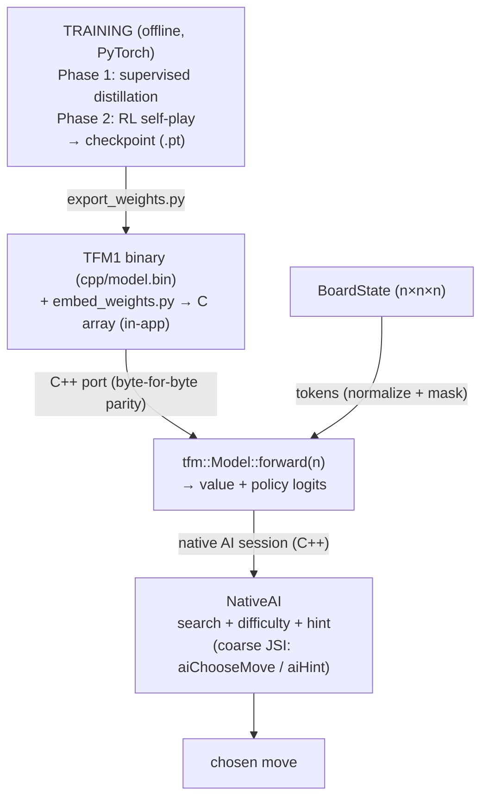

---

## The whole thing in plain English

**The idea in one sentence.** The game's AI is a tiny "brain" of about
106,000 numbers. Nobody programmed it with rules like *"if the opponent has
two in a row, block the third"* — instead it *learned* to play by watching a
perfect player and then playing millions of games against itself. This project
is a complete, from-scratch walkthrough of how to build that brain, and how to
shrink it so it fits inside a phone and runs offline.

**Think of each step like cooking from a recipe:**

| Step | Jargon | What it really is |
|------|--------|-------------------|
| 1. Turn the board into a language | *tokenizer* (§1) | Transformers were invented for text, but they work on any sequence. We treat the 27 cells of a 3×3×3 cube as 27 "words" and read them all at once. |
| 2. Give every box a meaning and a position | *embeddings* (§2) | Each cell gets a learned "meaning vector" (empty / mine / theirs) plus its 3D coordinate, so the brain knows both *what* is in each box and *where* it sits. |
| 3. Let every word read every other word | *self-attention* (§3) | Each cell "looks at" all the others at the same time. This is how the brain spots lines running diagonally through 3D space — the ones humans routinely miss. |
| 4. Ask two questions | *value + policy heads* (§4) | After thinking, the brain answers *"how likely am I to win?"* and *"which cell should I play next?"* |
| 5. Teach it | *supervised + RL training* | First it imitates a perfect solver (like studying grandmaster games), then it plays thousands of games against itself and learns from each win and loss. |
| 6. Ship it | *export → C++ → embed* (§6) | The 106k numbers are translated into a C++ file and embedded straight into the iOS/Android app, so it plays fully offline with no server. |

Each technical section below has a **Layman's take** box that re-explains the
same idea without the math.

---

## How the AI was built (the training journey)

### Phase 1 — Supervised pretraining: learn from a strong teacher

Before it can improve itself, the model first learns to **imitate the Go
alpha-beta solver** (`backend/distill`). The solver plays millions of games
and every position is labelled with its **best move** and **game value**:

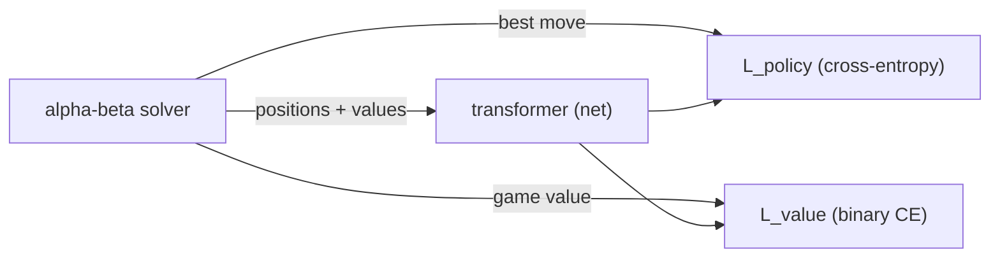

This is plain **supervised learning** — `L_policy` = cross-entropy against the
solver's best move, `L_value` = binary cross-entropy against the game outcome.
Train/eval are split by **whole games**, so eval positions never leak from
training games. It gives the network a strong policy/value baseline quickly.

#### Generating the training set with a Go solver

`backend/distill` is a small **Go** program that turns the alpha-beta solver
into a labelled dataset:

- It plays **full games** where the solver picks every move (with a 15%
  random-exploration chance so games vary): `distill -n 3 -games 100000`.
- **Every position visited** in a game is recorded as one sample — the board
  cells, the solver's **best move**, and the **game value** from the
  side-to-move's perspective — so one game yields ~n² labelled positions, not
  one.
- It is **parallelised** across all CPU cores, and each worker reuses a single
  `Solver` whose transposition table stays warm across positions and games — a
  big speedup for a full-tree search.

**Why it's called "distillation".** This is *knowledge distillation*: a strong,
slow, exact **teacher** (the alpha-beta solver) transfers its expertise into a
small, fast **student** (the transformer). The model doesn't re-learn the game
from scratch — it copies the teacher's answers on millions of positions until it
can reproduce them in milliseconds on a phone. `backend/distill` is the program
that turns the teacher into a training set.

**What the command-line flags mean:**

```
distill -n 3 -games 100000 -workers 8 -explore 0.15 -out distill_data.bin
```

| flag | meaning |
|------|---------|
| `-n 3` | the **cube size** — `-n 3` = 3×3×3 boards (27 cells), `-n 4` = 4×4×4 (64 cells), etc. |
| `-games 100000` | how many **full games** to play; each yields ~n² labelled positions |
| `-workers 8` | parallel goroutines (defaults to the number of CPU cores) |
| `-explore 0.15` | chance each move is a **random** move instead of the solver's best (15%), so games vary |
| `-out file` | output binary path |

**So was `-n 3` enough? No — and here's how one model plays every size.**

`-n 3` only says "generate the solver's data for a 3×3×3 board"; you run
`distill` once per size (`-n 4`, `-n 6`, …). Small boards matter because the
solver is exact and cheap there, so the model learns the *shared geometry*
(threats, forks, blocks) quickly — but a model trained only on 3×3×3 would
think "3-in-a-row wins", which is nothing on a 6×6×6 board. The universal
trainer therefore **mixes sizes every cycle** (`train_universal.py
--sizes 3,4,6`), and the resulting single set of weights plays any size thanks
to four things:

- **Variable-length sequence.** The board is simply `n³` tokens, and
  self-attention has no fixed input length — 27 tokens or 216 tokens flow
  through the same weights.
- **`n` is an input at forward time.** `model(x, mask, n=size)` tells the
  network the current board size whenever it runs.
- **Scale-free coordinates.** Each cell's `(x,y,z)` is divided by `n−1`, so
  positions always live in `[0,1]` (`CoordMLP` in `dev/training/model.py`). A
  cell "halfway to the opposite corner" is `0.5` whether the board is 3 or 6
  wide — so the learned position embedding means the same thing at every size
  and the geometry transfers.
- **Seeing several sizes teaches the real rule.** Winning means "`n` cells in a
  straight line along an axis or body diagonal". Only training on multiple
  sizes makes the network learn that rule *parameterised by `n`*, instead of
  memorising one board.

The output is a compact binary (per record: `n³` cells + move + value +
`game_id`); the `game_id` is how the trainer splits train/eval by whole games.

**Why we still need a model.** The solver is *exact*, but deciding one move
means searching the whole remaining game tree, and it only exists as a Go/C++
program we can't ship on a phone. And a lookup table is impossible, because the
number of positions the game can be in — the "movements" — is astronomically
large and explodes with board size:

| board | cells | reachable positions |
|-------|-------|---------------------|
| 3×3×3 | 27 | ~1.4 × 10¹² (1,405,135,196,755) |
| 4×4×4 | 64 | ~10³⁰ |
| 5×5×5 | 125 | ~10⁵⁹ |
| 6×6×6 | 216 | ~10¹⁰³ |

Across the sizes the game offers that's **~10¹⁰³ positions — far more than the
number of atoms in the observable universe (~10⁸⁰)**. Distilling even one
position per reachable board state is impossible, let alone storing a move for
each. The ~900k positions distilled from 100,000 solver games at 3×3×3 alone
cover **0.000064% (about 1 in 1.56 million)** of that board.

**What a lookup table would actually cost.** Say we store, per position, only
the best move + a win probability (≈9 bytes/entry, keyed by the 2-bit-per-cell
board):

| board | positions | table size (≈) |
|-------|-----------|----------------|
| 3×3×3 | 1.4 × 10¹² | ~12–20 TB |
| 4×4×4 | ~10³⁰ | ~10³¹ B — more storage than has ever been manufactured |
| 5×5×5 | ~10⁵⁹ | ~10⁶⁰ B |
| 6×6×6 | ~10¹⁰³ | ~10¹⁰⁴ B — more than the atoms in the universe |

Even the *smallest* board's table is ~15 TB (a room full of hard drives, when
the phone has a few GB) — and it only serves 3×3×3. Building it is equally
hopeless: enumerating ~10³⁰ positions for 4×4×4 at an optimistic **one
microsecond each** takes ~10¹⁶ years, a million times the age of the universe
(each entry is a full-tree solver search, not a free record).

The model replaces all of that with **106,690 parameters ≈ 0.43 MB** baked into
the app binary — roughly **30-million times smaller than the 3×3×3 table
alone**, and it plays every size at once. That is exactly why we train a model
instead of shipping a table.

### Phase 2 — RL: self-play policy gradient

Phase 1 gives the model **general knowledge** — it copies the solver's *move
choices* on the positions the solver happened to visit. But book knowledge is
not **experience**: the model has never felt the consequences of its own play,
and it can never be better than its teacher. That is what RL adds — the network
plays thousands of games against itself and each win/loss becomes feedback it
can learn from, the way a player who reads theory then plays real games turns
what they read into actual skill.

Then the network improves by **playing itself**. At every position it samples
a move from its **own** softmax policy (a `temperature` controls exploration),
plays a full game, and the game's outcome becomes the value target for every
position it visited:

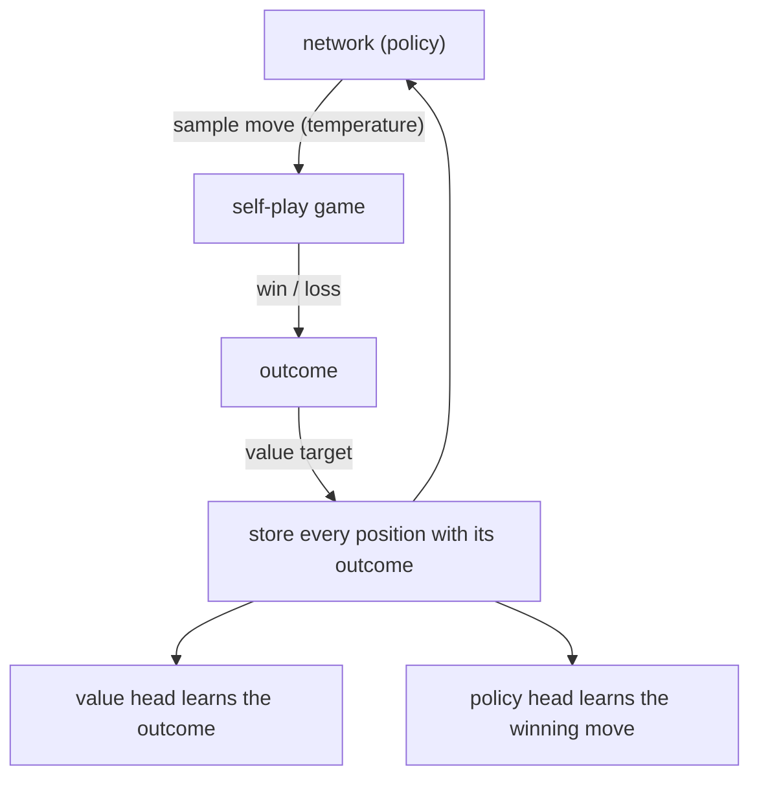

Because a better network generates better games next round, this is the
classic **policy-gradient / self-play** loop
(`training/train_universal.py` — one size-agnostic model trained on a mix of
3×3×3, 4×4×4 and 6×6×6 games, so a 6×6-trained model transfers to 3×3).

### Difficulty is hand-tuned, not a separate training phase

Easy / Medium / Hard are **not trained**. The app ships ONE universal model;
difficulty is a hand-tuned table of runtime knobs — search depth, move
temperature, blunder budget/rate — in the native AI session
(`mobile-rn/native/cpp/NativeAI.cpp`, `NativeAI::difficulty()`).

The training code lives in `dev/training/` and `dev/scripts/` (see
[Repo map](#repo-map)).

> **Layman's take.** Learning to play is like learning a musical instrument in
> two stages. First you *copy a master* — the solver shows you the perfect move
> for millions of positions, and the brain copies it until it's competent
> (Phase 1, supervised). Then you *practice alone*: the brain plays thousands of
> games against itself; whenever it wins, it slightly reinforces the moves that
> led to the win, and whenever it loses, it weakens them (Phase 2, RL). The
> Easy / Medium / Hard settings aren't trained at all — they're just runtime
> knobs that tell the finished brain how often to play a deliberately weaker
> move.

---

## 1. Input representation ("tokenizer")

There is no text tokenizer — **every cell of the cube is one token**, like a
word in a sentence. A board with 27 cells becomes a sequence of 27 tokens.

The board is **normalized so the side-to-move is always "X" (token 1)**, so the
model only ever needs to answer one question: "how good is this position for
the player whose turn it is?".

| cell state         | token | mask (legal?) |
|--------------------|-------|---------------|
| empty              | `0`   | `1`           |
| player to move (X) | `1`   | `0`           |
| opponent (O)       | `2`   | `0`           |

```
cells  = [ 0, 1, 0, 2, 0, ... ]   n=3 → 27 tokens
player = 2                        side-to-move is O
norm   = [ 0, 2, 0, 1, 0, ... ]   every non-empty O (2) becomes X (1),
                                  every non-empty X (1) becomes O (2)
mask   = [ 1, 0, 1, 0, 1, ... ]   1 where empty (legal moves)
```

> `mobile-rn/native/cpp/NativeAI.cpp` (the on-device AI session) and
> `dev/training/selfplay.py:_state` implement the same normalization; the C++
> engine re-checks it (`TfmEngine.cpp`).

> **Layman's take — the "tokenizer".** Transformers were invented for text, but
> they don't actually care about words — they care about *sequences*. Here we
> simply call each cell of the cube a "word": a 3×3×3 board is a 27-word
> "sentence", a 5×5×5 board is a 125-word sentence. The brain reads the whole
> sentence at once. We also do a small trick so the brain only ever has to learn
> *one* question — "am I winning?" — by always re-labelling the board so the
> player whose turn it is is called "X". The `mask` is just the list of
> legal (empty) cells, like telling the brain which words it's allowed to change.

---

## 2. Embedding

Two embeddings are added together to form the input to the transformer.

### 2a. Cell-type embedding

A learned `nn.Embedding(3, d_model)` table maps the token `{0,1,2}` to a
64-dim vector — the model learns a distinct vector for "empty", "mine", "their".

> **Layman's take.** A "64-dim vector" is just a list of 64 numbers that stands
> in for a word, like a dictionary entry. The brain starts with three random
> entries (empty / mine / theirs) and, during training, slowly rewrites them so
> that "mine" and "their" end up *feeling* different to the network. It's the
> same idea as a word-embedding in a chatbot: "king" and "queen" live near each
> other in the map, and here "empty" and "occupied" live far apart.

### 2b. Coordinate position encoding (size-agnostic)

Instead of learned position ids over `n³` flat indices (which would tie the
model to one cube size), each cell's 3D coordinate `(x, y, z)` is normalized
to `[0, 1]` and pushed through a small MLP:

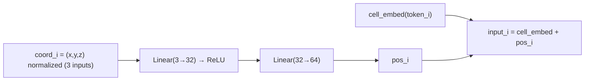

Because coordinates always live in `[0,1]` regardless of `n`, **one trained
model works for any cube size** (3×3×3, 4×4×4, … 6×6×6). This is what makes
the "universal" model possible.

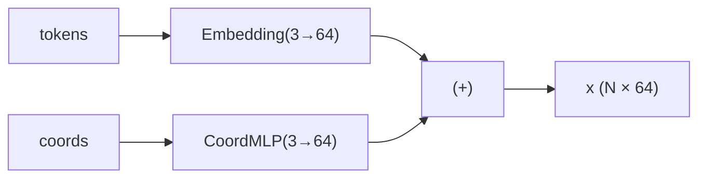

> **Layman's take — position.** A word's *meaning* alone isn't enough; you also
> need to know where it sits in the sentence. ("the cat bit the dog" ≠ "the dog
> bit the cat".) So each cell also gets a small vector built from its 3D
> coordinate `(x, y, z)`. Because coordinates are squeezed into the range
> 0…1 regardless of the cube size, the *same* trained brain understands a 3×3×3
> board, a 4×4×4 board, and a 6×6×6 board — one model, every size.

---

## 3. Transformer encoder

Two stacked encoder blocks process the token sequence. Each cell attends to
every other cell, which is exactly what lets the model see **lines that run
diagonally through 3D space** (self-attention has no locality bias).

### How self-attention works (the Q/K/V story)

> **Layman's take.** Imagine each cell is a guest at a round-table meeting, and
> every guest wants to hear what every other guest has to say before making up
> their mind. That's exactly what "self-attention" does. Mechanically each cell
> writes three notes about itself:
>
> - a **Query** (Q) — "this is what I'm asking about",
> - a **Key** (K) — "this is what I have to offer",
> - a **Value** (V) — "this is my actual message".
>
> Every cell then looks at every other cell and scores "does your Key answer my
> Query?" — cells that match get more attention, and the final output for each
> cell is a weighted mix of everyone's Values. This is why the network sees
> winning lines that cut diagonally through the cube: the two cells at opposite
> corners of a diagonal pair up their Keys and Queries even though they're far
> apart in the flat array. The "8 heads" just means the meeting happens 8 times
> in parallel, each paying attention to a different kind of relationship
> (e.g. one head might track straight rows, another the space diagonals).

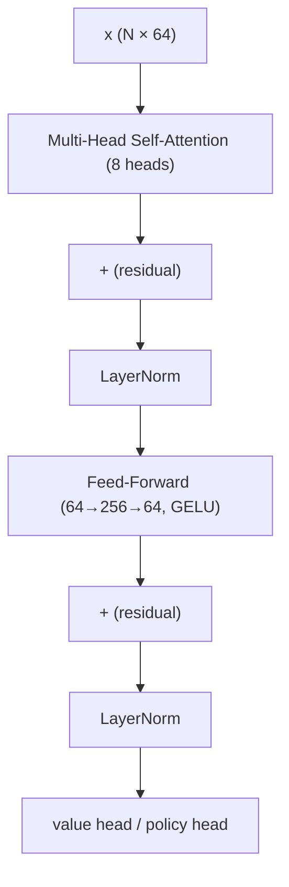

> **Why residual connections + LayerNorm?** The "+(residual)" is a shortcut that
> lets each cell keep its original information and only *adjust* it, rather than
> fully rewriting it — this makes deep networks far easier to train (a famous
> idea that made very deep transformers possible). LayerNorm just rescales the
> numbers so they stay in a healthy range as they flow through the network —
> think of it as "keep your volume reasonable" at each step.

Each block implements the standard `norm_first=False` (post-norm) residual
pattern:

```
attn = MultiHead(x)
x    = LayerNorm(x + attn)
ff   = GELU(Linear(x)) → Linear
x    = LayerNorm(x + ff)
```

---

## 4. Heads

The encoder outputs one 64-dim vector **per cell**. Two small heads turn them
into the model's answers.

### Value head — "how good is this position?"

Mean-pool the per-cell vectors into a single vector, then an MLP:

```
pooled = mean over cells of x        (1 × 64)
value  = Linear(64→64) → ReLU → Linear(64→1)     → value logit v
P(win for side-to-move) = sigmoid(v)
```

> **Layman's take.** After the attention meeting, every cell has formed an
> opinion. The value head simply *averages all the opinions* into one number and
> converts it into a "chance of winning" between 0% and 100%. In a position
> where you're about to complete a line, it should say ~99%; in a hopeless
> position, ~1%.

### Policy head — "where should I play?"

A single `Linear(64→1)` per cell produces a raw logit per cell:

```
policy_i = Linear(x_i)   for every cell i     (N logits)
```

Illegal moves (occupied cells) are set to **−∞** so the softmax ignores them:

```
probs_i = softmax(policy)_i        over legal cells only
best move = argmax over legal cells
```

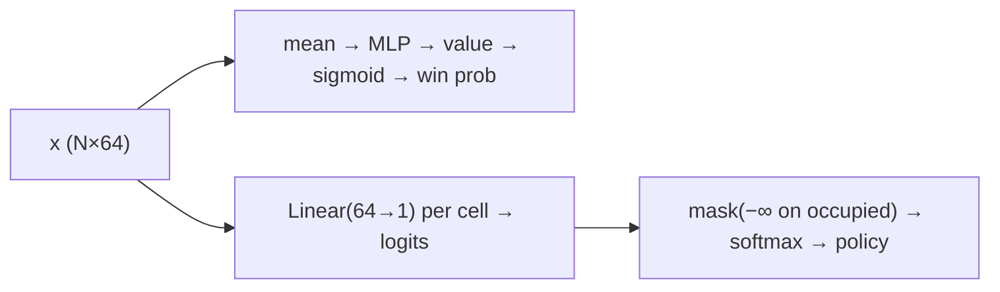

> **Layman's take — policy.** The policy head is the "where do I move?" answer:
> each cell gets a raw score, occupied cells are disqualified (masked to −∞),
> and the scores are turned into a ranked list of probabilities. Playing the
> highest-probability cell is the "best" move; sampling from the list with some
> temperature is how the brain explores during training and how Easy/Medium
> levels add variety.

---

## 5. One forward pass — end to end

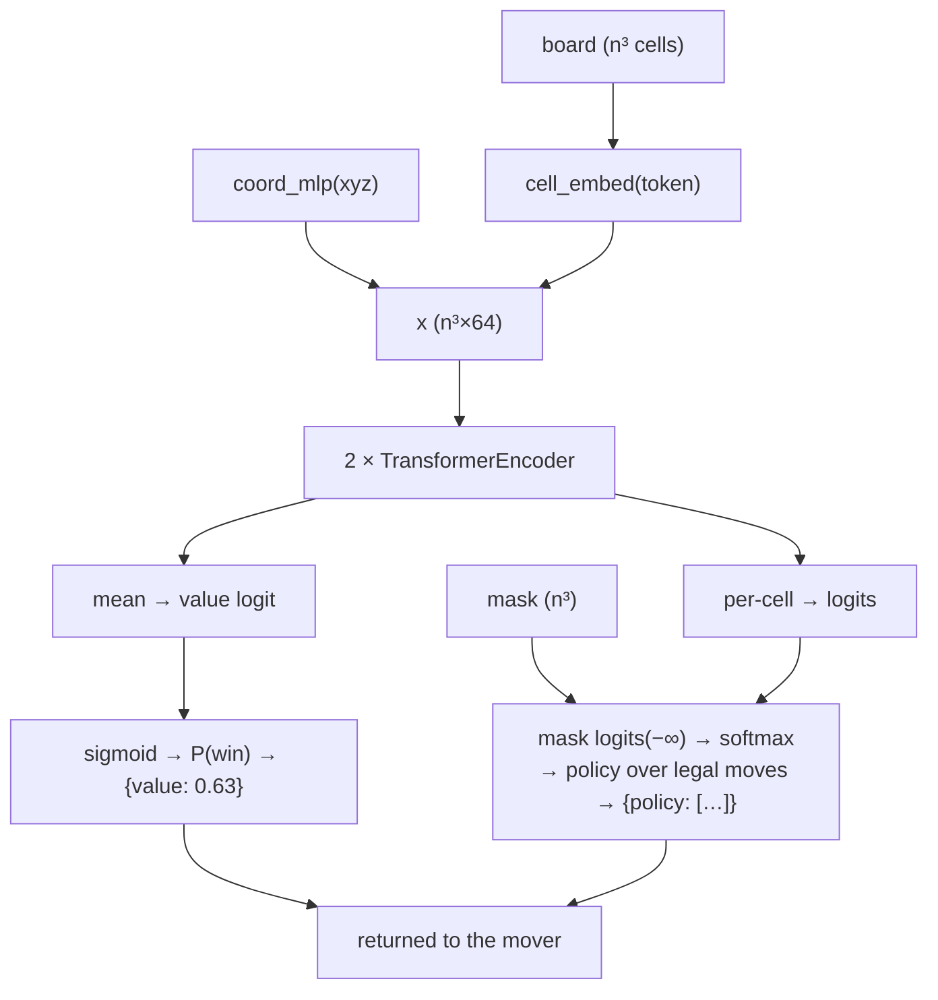

The C++ implementation mirrors PyTorch **exactly** (eval mode, dropout off)
and is checked byte-for-byte against the reference graph by a parity test
(`cpp/tools/check_parity.py`, `mobile-rn` parity jest test).

> **Layman's take — the whole forward pass.** Feeding a board through the network
> is like running a single question through the brain: the board becomes a
> "sentence" of cells → each cell gets a meaning + position → every cell reads
> every other cell (attention) → the value head says "you're 63% likely to win"
> and the policy head hands back a ranked list of legal moves. One forward pass,
> a handful of milliseconds, two answers.

---

## 6. Export → on-device C++

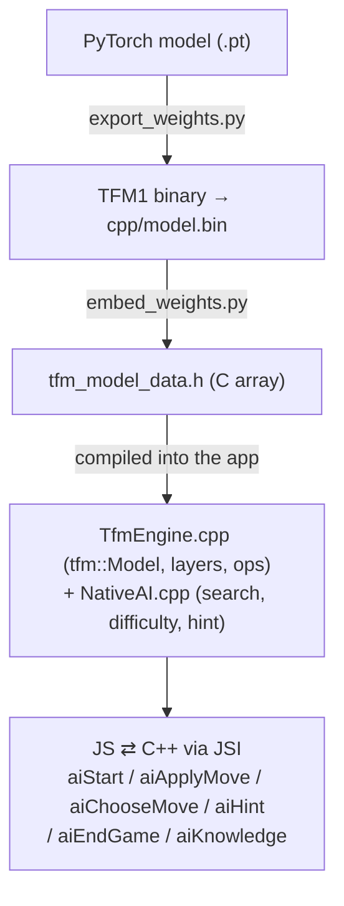

The weights ship **inside the app binary** — no filesystem I/O, no network,
no runtime framework. The C++ engine is registered as a TurboModule
(`TfmEngine`) and exposed to JS, with a byte-for-byte parity guarantee against
the PyTorch graph.

`numel()` = **106,690** parameters.

> **Layman's take — "translating the recipe".** The brain was trained in Python
> (PyTorch) as a bunch of layer definitions and 106,690 numbers. To run on a
> phone, we *translate* it by hand into C++ — the exact same operations, re-written
> in a language the phone can run natively. The weights are then baked into the
> app binary as a giant C array, so nothing is downloaded at runtime and there is
> no server anywhere. The "parity test" is our guarantee that the phone's C++
> brain makes byte-for-byte the same decisions the Python brain would — otherwise
> Easy/Medium/Hard behaviour would silently differ between desktop and phone.

---

## 7. Search + difficulty (runtime behavior)

The raw network is combined with a shallow lookahead to decide moves. **The
whole runtime — search, difficulty, hint, opponent memory and profiles — lives
in the native AI session (`mobile-rn/native/cpp/NativeAI.cpp`); React calls it
through coarse JSI methods (`aiChooseMove`, `aiHint`, …):**

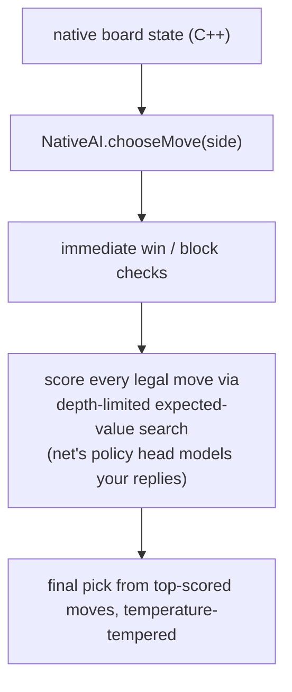

**Difficulty is not a different model** — it's runtime search parameters over
the SAME weights (`NativeAI::difficulty()`):

|            | Easy (≈65% AI win) | Medium (≈80%) | Hard (≈95%) |
|------------|---------------------|---------------|-------------|
| search depth | 1 | 3 | 4 |
| deliberate blunders | up to 6 **random** moves (~25% of neutral moves; ~90% when it's already clearly winning) | exactly **1 suboptimal** move, only when about to win | none |
| move randomness | high (temp 1.1) | medium (temp 0.5) | near-greedy (temp 0.1) |
| extra | defensive bias; adapts to the player's results | — | — |

### It learns your habits (opponent memory)

On top of the fixed transformer weights, the app keeps a small, persistent
**opponent memory** — a per-side map of *which cells you like to play*,
maintained entirely on-device and held in the native session
(pure bookkeeping, no weight updates):

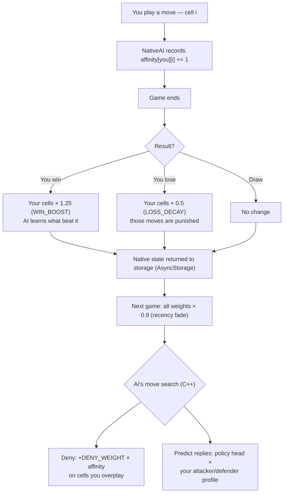

- **Recorded live** — every move you make increments that cell's affinity for
  your side (inside `NativeAI::recordAffinity`).
- **Rewarded / punished after every game** — win → your played cells are boosted
  1.25× (`WIN_BOOST`); lose → they are decayed 0.5× (`LOSS_DECAY`); a draw
  leaves them unchanged (`NativeAI::endGame`).
- **Decayed per game** (× 0.9) so recent sessions count more than old ones.
- **Persisted to on-device storage**, so the memory survives app restarts — the
  native session returns its state (`aiEndGame` / `aiState`) and React stores it
  via `opponentStorage.ts`.

The search then uses this memory two ways while playing against you, all inside
the native session (`NativeAI::chooseMove`):

1. **Denying your favourite cells.** Every move you've overplayed gets a
   "deny" bonus (`DENY_WEIGHT × affinity[you][cell]`) added to the AI's own
   move scores, so the AI prefers to take those cells itself instead of leaving
   them open — the more you play a square, the more the AI snatches it.
2. **Predicting your replies.** During its lookahead the AI models where you're
   likely to move next using the network's policy head, re-weighted by your
   **style profile** (attacker vs. defender — how often you build threats vs.
   block), so it spends its search budget on the replies you're most likely to
   make.

The affinity-blended move prediction is also exposed for the internal
model-knowledge panel (`aiKnowledge` → predicted replies + win probabilities +
best move). The old TS AI modules (`src/ai/mover.ts`, `predictor.ts`,
`opponentMemory.ts`) are now kept only as the reference implementation and
Jest parity fixtures — the shipped app runs the native session.

Difficulty also adapts to your recent results (win too much → it hardens; lose
too much → it eases up).

> **Layman's take — thinking ahead.** The brain alone is a one-shot "move
> guesser". To be stronger, the game combines it with a mini search: "if I play
> here, what's my expected chance of winning, assuming I keep using the brain for
> the rest of the game?" — then it picks the move with the best score. Hard
> *thinks 4 moves ahead* and never blunders; Medium thinks 3 ahead and makes one
> subtle slip when it's about to win; Easy barely thinks (1 move), blunders up to
> 6 times with fully random moves, and mostly *defends* instead of attacking. So
> "difficulty" isn't a different brain — it's just how deep it thinks and how
> often it deliberately plays badly.

---

## 8. Runtime data flow — what the model sees, and what happens after

> **Layman's take — an assembly line.** Every AI move is a short pipeline:
>
> 1. **The brain only answers two questions per position.** You hand it the
>    board; it replies with *"how likely is the side to move to win?"* and
>    *"which empty cells look best?"* — nothing more. It has no rules, no
>    strategy, and no memory of you.
> 2. **The engine does the thinking after that.** It plays "what-if" scenarios a
>    few moves ahead, guesses what *you* would play, and — the important part —
>    decides whether to actually play the **best** move or a **deliberately
>    weaker but still winning** one.

### The model is trained to be nearly perfect — difficulty is how often it *isn't*

The transformer is trained to **win**: it imitates a perfect alpha-beta solver
(Phase 1 distillation) and then refines itself by self-play (Phase 2 RL), so its
"best move" is genuinely strong. Difficulty is **not** a different, weaker
model — it is a knob on how the engine *uses* the near-perfect answer:

- The search scores **every** legal move and returns a ranked top-K of expected
  values (`searchScored` → `{moves, values}`).
- The difficulty layer then **deliberately picks a lower-ranked option** — a
  move the model still believes has a real chance of winning, just not the
  absolute best:
  - **Hard** → near-greedy: picks the top-scored move.
  - **Medium** → high temperature plus one "good-but-not-best" slip: samples
    among the strong top moves.
  - **Easy** → high temperature plus explicit blunders: frequently picks a
    random/weak legal move (bounded), and plays defensively.

So you never face a "dumber brain" — you face a nearly perfect brain that is
**told to make a mistake** a tunable fraction of the time. The model itself
stays optimal; only the **move selection after inference** is softened.

### What is sent to the model

Per position, the model only ever receives:

| input | value |
|-------|-------|
| tokens | each cell `{0,1,2}`, normalized so the side-to-move is always `1` |
| mask   | `1` on empty/legal cells, `0` on occupied |
| n      | cube size |

For a whole move, the native search additionally receives the raw board, the AI
side, and the search parameters (`depth`, `topK`, `maxNodes`, `aggression`, `n`).

### What is processed after inference

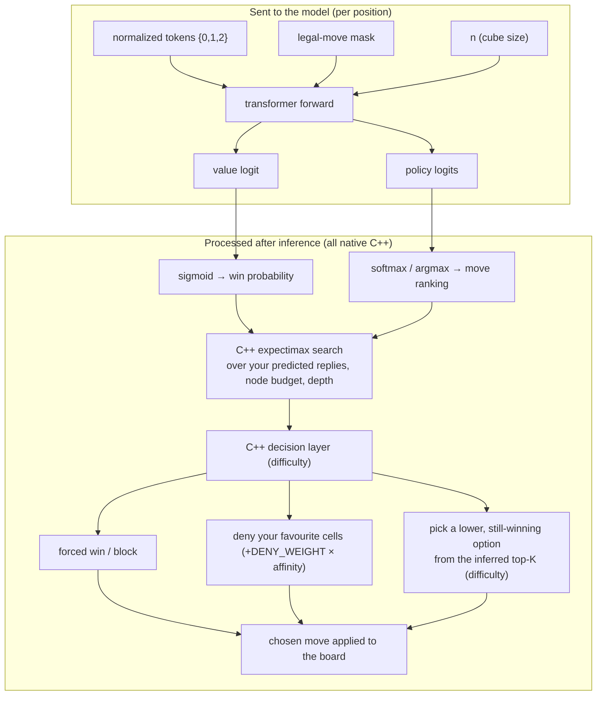

- **C++ (the native AI session):** `sigmoid(value)` → win probability;
  `softmax/argmax(policy)` → move ranking and the opponent's likely replies; the
  expectimax search sums expected value over those replies within the node
  budget. Then the decision layer — forced win/block checks, the affinity
  **deny** bias, the **defensive** bias (Easy), the **difficulty selection**
  (sampling a lower-ranked but viable move from the top-K) — and the chosen
  move is returned to React, which only applies it to the render mirror.
- **React (after the native call):** applies the returned move to the JS `Board`
  (the visual/game-state mirror) and updates the snapshot; it no longer runs
  any search or AI logic.

---

## Build & run

Quick orientation — the shipping app is `mobile-rn/`, the shared engine is
`cpp/`, all offline ML/dev tooling is `dev/`. Full per-component docs:

- [mobile-rn/README.md](mobile-rn/README.md) — the iOS/Android app: build, run,
  APK, tests
- [mobile-rn/native/README.md](mobile-rn/native/README.md) — the C++ JSI
  engine + iOS/Android build wiring
- `dev/scripts/`, `dev/training/` — training and export scripts
- `dev/frontend/` — the web frontend (Vite/React)

### 0. One-time setup

**Host requirements**

- **Python 3 + PyTorch** (training only)
- **C++17** compiler + CMake (engine + parity)
- **iOS**: macOS + Xcode + CocoaPods
- **Android**: Android SDK + **NDK 27.1.12297006** + JDK 17

**Local build secrets (gitignored).** Signing values are never committed. Create
`mobile-rn/scripts/build-secrets.env` locally (see `mobile-rn/.gitignore`) and
fill in your Apple Developer Team ID and Android keystore passwords:

```bash
# mobile-rn/scripts/build-secrets.env   (gitignored — do not commit)
IOS_TEAM=XXXXXXXXXX             # Apple Developer team ID
KEY_STORE_PASS=your-store-pass   # Android release.keystore store password
KEY_PASS=your-key-pass           # Android release.keystore key password
```

The Makefile, `build_apk.sh` and the iOS export-plist generator all source this
file; an environment `export` of the same names overrides it. Without it, the
iOS/Android release targets refuse to run.

**Generate native projects (once).** `expo prebuild` recreates `mobile-rn/android/`
and `mobile-rn/ios/` from `app.json` (the `withTfmEngine` plugin also writes the
Android CMake/OnLoad wiring and the iOS registration file):

```bash
cd mobile-rn
npm install
npx expo prebuild            # runs the withTfmEngine plugin
cd ios && pod install        # iOS CocoaPods
```

> ⚠️ `expo prebuild` **clears `mobile-rn/android/`**, which also removes the
> local `release.keystore`. Keep a backup of your keystore outside the repo and
> restore it into `mobile-rn/android/` after prebuild. The iOS engine
> registration file (`native/TfmEngineRegistration.mm`) is regenerated by the
> plugin.

### 1. The engine (C++ → parity)

```bash
make cpp          # builds parity_test + tfm-cli + libmodel.so into cpp/build
make parity       # full C++ ⇄ PyTorch parity check (fixtures + random cross-check)
```

### 2. Release builds (embedded bundle — no Metro)

The Makefile provides **public release** and **internal** targets. "Internal"
builds bake `EXPO_PUBLIC_INTERNAL_DEBUG=1` into the JS bundle so the AI
debug / model-knowledge panel is included; public release builds compile it out.
Both are Release configurations — the JS bundle is embedded, so no Metro / dev
server is needed at runtime.

```bash
# iOS — build for a connected device (UDID is auto-detected)
make ios-release                # public release
make ios-internal               # internal (+ AI debug panel)

# iOS — App Store Connect IPA (archive + export)
make ios-release-ipa            # → /tmp/ISOCUBE-release-export/ISOCUBE.ipa
make ios-internal-ipa           # → /tmp/ISOCUBE-internal-export/ISOCUBE.ipa

# Android — signed release APK
make android-release            # → mobile-rn/dist-apk/neoncube-phone-release.apk
make android-internal           # internal (+ AI debug panel)

# Both platforms
make release                    # ios-release + android-release
make internal                   # ios-internal + android-internal
```

Notes:
- iOS device builds require a connected iPhone (or set `IOS_UDID=<udid>`).
- iOS signing uses `IOS_TEAM` from `build-secrets.env`, passed as
  `DEVELOPMENT_TEAM`; the App Store export plist is generated at build time.
- Android signing uses `mobile-rn/android/release.keystore` with
  `KEY_STORE_PASS` / `KEY_PASS` from `build-secrets.env`.

### 3. Development (Metro / dev server)

```bash
cd mobile-rn
npx expo run:ios               # builds + starts Metro (macOS + Xcode required)
npx expo run:android           # builds + installs a debug build on a device (adb)
```

### 4. Tests

```bash
make test                   # cpp parity + backend pytest + mobile jest
```

---

## Repo map

```
mobile-rn/                 the ISOCUBE app (Expo/React Native 0.86)
cpp/                       shared C++ transformer engine (compiled into the app)
dev/                       everything else: training, backend, web, tooling
dev/
  backend/                 game rules, ML agent wiring, server, alpha-beta distill
  training/                PyTorch training: model.py, selfplay, trainers
  scripts/                 training and export scripts
  frontend/                web frontend (Vite/React)
  model_universal.pt       trained checkpoint
```

ML parts in detail:

```
dev/training/
  model.py            ValuePolicyTransformer (tokenizer, embeds, encoder, heads)
  selfplay.py         self-play game generation
  train_universal.py  size-agnostic self-play (RL) trainer
  train_distill.py    alpha-beta distillation (supervised) trainer
  eval.py             strength evaluation vs random
  torch_loader.py     checkpoint loader + TorchModelAdapter (eval seam)
dev/backend/
  distill/            Go alpha-beta solver (distillation teacher)
  ml/                 game-server AI wiring (torch-free)
cpp/
  include/tfm/*.hpp   C++ model: model.hpp, layers.hpp, ops.hpp, weights.hpp
  src/                model.cpp, layers.cpp, ops.cpp, weights.cpp, search.cpp
  tools/export_weights.py   PyTorch → TFM1 binary
  tools/check_parity.py     C++ vs PyTorch parity
  tests/parity.cpp          on-host parity test
mobile-rn/
  native/cpp/NativeAI.cpp  native AI session (search, difficulty, hint, memory, profiles)
  native/cpp/TfmEngine.cpp JSI/TurboModule host functions (coarse ai* methods)
  native/include/tfm_model_data.h   embedded weights (C array)
  native/TfmEngineRegistration.mm   iOS global registrar (add to target)
  scripts/embed_weights.py          bin → C header
  src/native/TfmEngine.ts   JS ↔ JSI wrapper (aiStart / aiChooseMove / …)
  src/ai/                   reference implementation + Jest parity fixtures
  src/three/                Blender-baked 3D geometry (assets → TS)
  assets/sprites/           Blender-rendered 60fps turn-mascot sprite sheets (TurnFidget)
```

---

## Glossary

Plain-English definitions of the acronyms and jargon used above.

### Model & inference

| Term | What it means, in plain English |
|------|---------------------------------|
| **Transformer** | The neural-network architecture used here. Every cell "reads" every other cell at once (attention), so it can spot lines running diagonally through 3D space. |
| **Model** | The trained "brain": a fixed set of numbers (weights) plus the code that uses them. |
| **Training** | The phase where the brain's numbers are adjusted from data until it plays well. |
| **Inference / forward pass** | Running the trained brain on a position to get an answer ("how good is this?" + "which move?"). The actual game only ever does inference — never training. |
| **Epoch** | One complete pass over the whole training set. |
| **Loss** | A number saying how wrong the brain's answer was on a sample; training nudges weights to make it smaller. |

### Network parts & math

| Term | What it means, in plain English |
|------|---------------------------------|
| **Token** | One input item — here, one cell of the cube ("a word in a sentence"). |
| **Tokenizer** | The step that turns the board into tokens (`{0,1,2}` + a legal-move mask). |
| **Embedding** | A learned "meaning vector" for a token — a list of numbers the network learns to give meaning (empty / mine / theirs). |
| **d_model** | The size of each token's meaning vector (64 here). |
| **MLP (Multi-Layer Perceptron)** | A small stack of "matrix multiply + activate" layers — the simplest kind of neural network. Used for the coordinate encoding and the value head. |
| **d_FF (feed-forward width)** | The internal width of the encoder's middle layer (256 here). |
| **nhead / heads** | How many parallel attention "meetings" run at once (8). |
| **Attention / QKV** | **Q**uery/**K**ey/**V**alue: each token asks "how relevant are the others?" and mixes in their messages weighted by the answer. |
| **LayerNorm** | Rescales numbers so they stay in a healthy range as they flow through the network. |
| **GELU** | A smooth "soft on/off" activation function used in the feed-forward layer. |
| **Logit** | A raw, unbounded score before it is turned into a probability. |
| **Sigmoid** | Squeezes one number into a 0–1 probability (used for "win chance"). |
| **Softmax** | Turns a list of scores into probabilities that sum to 1 (used for "which move?"). |
| **Argmax** | "Pick the highest-scoring item" (the best move). |
| **CE / BCE (Cross-Entropy / Binary Cross-Entropy)** | Loss functions for classification — how far the predicted move/outcome is from the correct one. |
| **Top-K** | The K highest-scoring moves returned by the search. |
| **Temperature** | A knob that flattens or sharpens probabilities — higher = more random sampling, lower = more greedy. |

### Training methods

| Term | What it means, in plain English |
|------|---------------------------------|
| **Supervised learning** | Learning from labelled examples ("here's the perfect move for this position"). |
| **Distillation** | Training a small model to imitate a strong teacher (here, the alpha-beta solver). |
| **Alpha-beta solver** | An exact search algorithm that explores the whole game tree (with pruning) and always finds the true best move — the "grandmaster" teacher. |
| **RL (Reinforcement Learning)** | Learning from the outcome of your own actions (win / loss) instead of a teacher. |
| **Self-play** | RL where the model plays games against itself. |
| **Policy gradient** | The RL method that reinforces moves which led to wins and weakens those that led to losses. |
| **Value** | The model's "win chance" answer for the side to move. |
| **Policy** | The model's "which move to play" answer — a ranked/probability list over legal moves. |
| **Expectimax** | A search that evaluates a move by the *expected* value over the opponent's likely replies. |

### On-device & tooling

| Term | What it means, in plain English |
|------|---------------------------------|
| **JSI (JavaScript Interface)** | React Native's C++↔JS bridge — how the app's JavaScript calls the compiled C++ engine. |
| **TurboModule** | React Native's New-Architecture mechanism for exposing a native module to JS. |
| **GEMM (General Matrix Multiply)** | The core "multiply a big grid of numbers" operation a transformer is mostly made of; sped up on-device with Eigen/Accelerate. |
| **Parity** | Proof that the C++ engine gives bit-identical results to the Python reference. |
| **RN / R3F** | React Native (the mobile framework) and @react-three/fiber (the React renderer for three.js). |
| **GLB / GLTF** | 3D model file formats (Blender → game assets). |
| **SDK / NDK / JDK** | Android Software Development Kit / Native Development Kit / Java Development Kit — the Android toolchains. |
| **APK / IPA** | The Android / iOS app packages you install. |
| **PvE** | Player vs Environment — here, a human vs the AI (no multiplayer). |
| **GPL (GNU General Public License)** | This project's open-source license — you can use, study and modify it freely as long as you share your changes under the same license. |
| **LRU (Least Recently Used)** | A cache policy that evicts the oldest entry first (used to memoize repeated board evaluations). |

---

## License

GNU General Public License v3.0 — see [LICENSE](LICENSE).

This is a free, from-scratch project written to show how a transformer works
and how to take it all the way to a shipping product: tokenization, embedding,
attention, training (supervised → self-play RL), a byte-for-byte C++ port, and
on-device inference in a real mobile game.